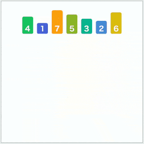
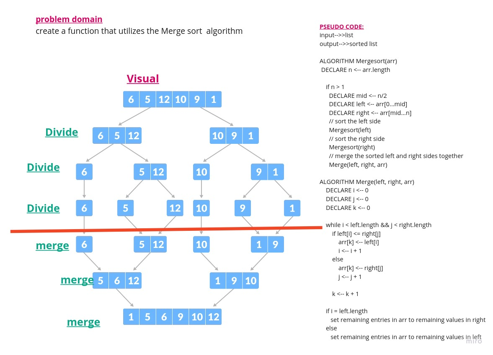
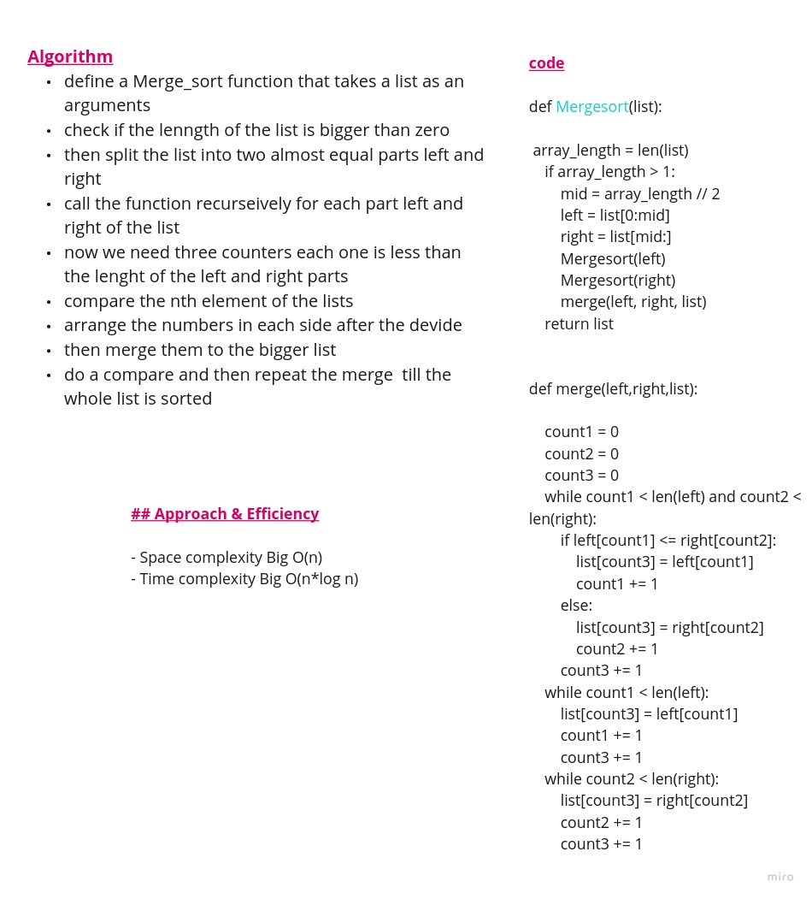

# Divide and Conquer
## Merge Sort


Merge sort is one of the most efficient sorting algorithms. It works on the principle of Divide and Conquer. Merge sort repeatedly breaks down a list into several sublists until each sublist consists of a single element and merging those sublists in a manner that results into a sorted list.



**Algorithm**
define a Merge_sort function that takes a list as an arguments
check if the length of the list is bigger than zero
then split the list into two almost equal parts left and right
call the function recursively for each part left and right of the list
now we need three counters each one is less than the length of the left and right parts
compare the nth element of the lists
arrange the numbers in each side after the divide 
then merge them to the bigger list
do a compare and then repeat the merge  till the whole list is sorted


**Pseudo Code**

```python
ALGORITHM Mergesort(arr)
    DECLARE n <-- arr.length

    if n > 1
      DECLARE mid <-- n/2
      DECLARE left <-- arr[0...mid]
      DECLARE right <-- arr[mid...n]
      // sort the left side
      Mergesort(left)
      // sort the right side
      Mergesort(right)
      // merge the sorted left and right sides together
      Merge(left, right, arr)

ALGORITHM Merge(left, right, arr)
    DECLARE i <-- 0
    DECLARE j <-- 0
    DECLARE k <-- 0

    while i < left.length && j < right.length
        if left[i] <= right[j]
            arr[k] <-- left[i]
            i <-- i + 1
        else
            arr[k] <-- right[j]
            j <-- j + 1

        k <-- k + 1

    if i = left.length
       set remaining entries in arr to remaining values in right
    else
       set remaining entries in arr to remaining values in left

```

## Approach & Efficiency

- Space complexity Big O(n)
- Time complexity Big O(n*log n)

## Solution
```python
def Mergesort(list):

    array_length = len(list)
    if array_length > 1:
        mid = array_length // 2
        left = list[0:mid]
        right = list[mid:]
        Mergesort(left)
        Mergesort(right)
        merge(left, right, list)
    return list
  
```
# white board 




[PR](https://github.com/GhaidaMomani/data-structures-and-algorithms/pull/18)