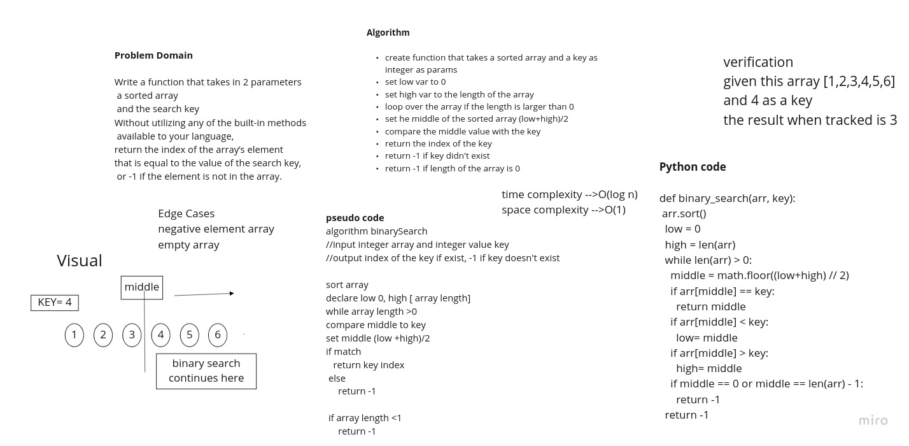

# Data Structures and Algorithms

## Code 401 - Advanced Software Development

By [Ghaida Al Momani] (https://github.com/GhaidaMomani).

>>>>>Welcome to Code 401.
<br/>
<hr/>
<br/>


# Binary Search of Sorted Array
<!-- Description of the challenge -->
Write a function called binary_search which takes in 2 parameters: a sorted array and the search key. Without utilizing any of the built-in methods available to your language, return the index of the array’s element that is equal to the search key, or -1 if the element does not exist.

<br/>


## Whiteboard Process
<!-- Embedded whiteboard image -->


## Approach & Efficiency
<!-- What approach did you take? Discuss Why. What is the Big O space/time for this approach? -->
Time Big O(log N)
Space Big O(1)


<hr/>
<br/>


### Installation

1. Get a free API Key at  [Repo Link](https://github.com/GhaidaMomani)
2. Clone the repo
   ```sh
   git clone https://github.com/GhaidaMomani/data-structures-and-algorithms.git
   ```


<hr/>
    <p align="right">(<a href="#top">back to top</a>)</p>

<!-- ROADMAP -->
## Roadmap

- [1] Each Code Challenge will have it's own README file.
- [2] The README will contain the link of the articles ans resourses
- [3] The README will contain Date of the written summary.


# Table of Contents

 |Title | Brief      |
 |:---------: |:--------------:|
 |[Array Reverse](array-reverse/ARRAYREVERSE.md)
 |[Array Insert Shift](array-insert-shift/array-insert-shift.md)| 
 |[Array Binary Search](./array-binary-search.py)|


<hr/>
    <p align="right">(<a href="#top">back to top</a>)</p>

   


   
<!-- ## Note :

 
<hr/>
    <p align="right">(<a href="#top">back to top</a>)</p> -->


  <br/><br/>

<p align="right">Ghaida Al Momani, Software Engineer</p>
<p align="right">Jordan, Amman</p>
  <p align="right">22, 01 MAR </p>