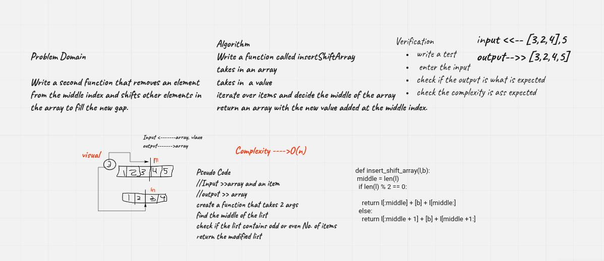

# Data Structures and Algorithms 
## Code 401 - Advanced Software Development
## Code Challenge: Array Insert Shift

By [Ghaida Al Momani] (https://github.com/GhaidaMomani).
 

 

<!-- Description of the challenge -->
# Array Insert Shift
Insert and shift an array in middle at index

 

## Whiteboard Process
<!-- Embedded whiteboard image -->

 

    
(<a href="#top">back to top</a>)

## Approach & Efficiency
<!-- What approach did you take? Discuss Why. What is the Big O space/time for this approach? -->

**O(n)**

### Example:
| Input | Output |
| ----- | ------ |
| `[2,4,6,-8]` | `[2,4,5,6,-8]` |
| `[42,8,15,23,42], 16	` | `[42,8,15,16,23,42`|

 

    

Ghaida Al Momani, Software Engineer

Jordan, Amman

  
22, 1 MAR 
