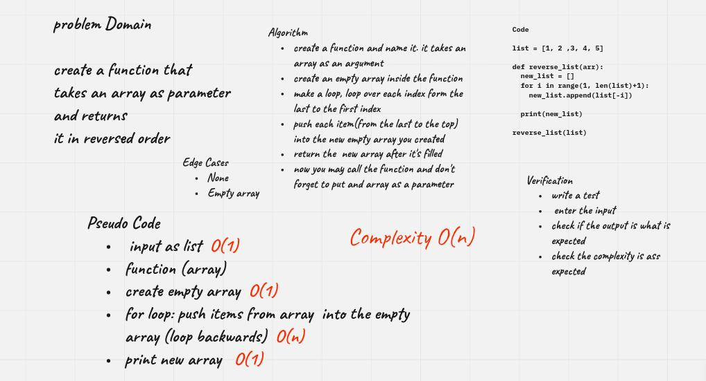

# Data Structures and Algorithms 
## Code 401 - Advanced Software Development
## Code Challenge: Reverse an array.
 

By [Ghaida Al Momani] (https://github.com/GhaidaMomani).
 

 

## Task Description
**Feature Tasks**
 Write a function called reverseArray which takes an array as an argument. Without utilizing any of the built-in methods available to your language, return an array with elements in reversed order.

 

## Whiteboard Workflow

 

    
(<a href="#top">back to top</a>)

    

Ghaida Al Momani, Software Engineer

Jordan, Amman

  
22, 28 Feb 
