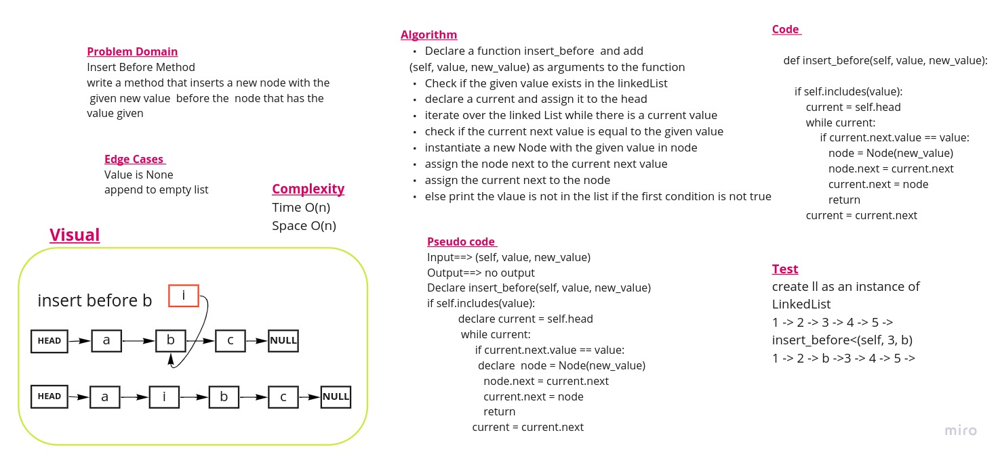

#  Linked Lists
## Part Two of the Challenge  
## Challenge Type: append and insertions

# Part Two of the Challenge 
## Challenge Type: Extending an Implementation

***append***

This function takes the argument new value
It adds a new node with the given value to the end of the list

***insert before***

This function takes the arguments value, new value
It adds a new node with the given new value immediately before the first node that has the value specified

***insert after***

This function takes the arguments value, new value
It adds a new node with the given new value immediately after the first node that has the value specified

## Solution
[Code](linked_list/linked_list_append.py)

(<a href="#top">back to top</a>)

    

Ghaida Al Momani, Software Engineer

Jordan, Amman

22, 12 MAR 

