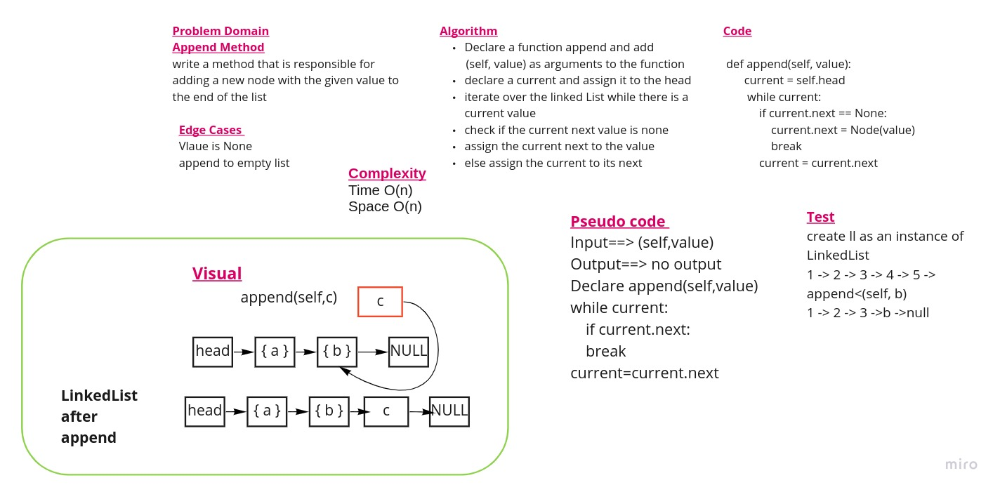
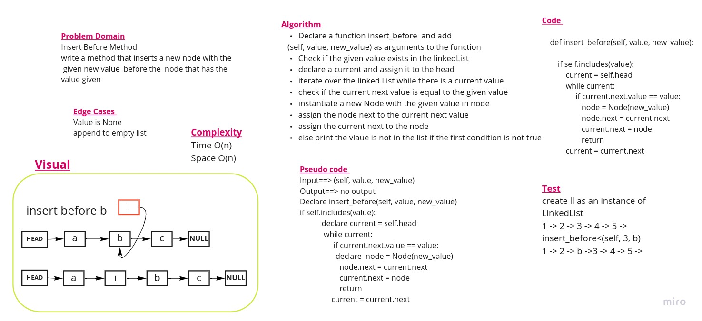
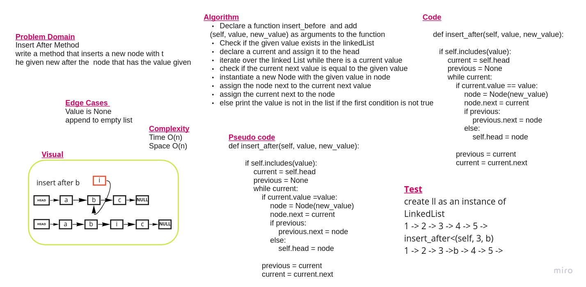
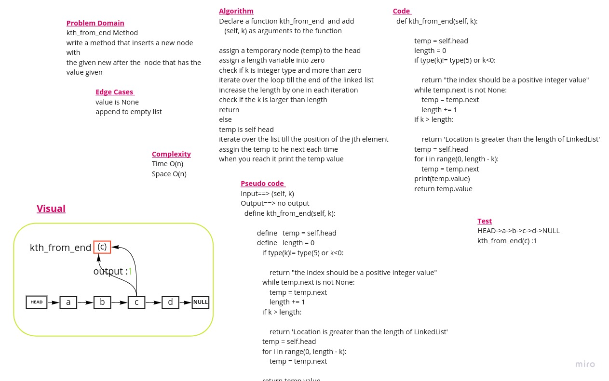

# Singly Linked List
## Challenge 06
<!-- Short summary or background information -->
Linked List is a linear data structure. It is a series of connected "nodes" that contains the "address" of the next node. Each node can store a data point which may be a number, a string or any other type of data.

***A singly linked list*** is a type of linked list that is unidirectional, that is, it can be traversed in only one direction from head to the last node (tail).
## Challenge
***Description of the challenge***

Create a Node classs and LinkedList class that will have a singly linked list properties like adding element to the beginning of the linked list, check for the existence of the elemnt in the list and print all list elements as a string 

## Approach & Efficiency
<!-- What approach did you take? Why? What is the Big O space/time for this approach? -->
This is the complexity for time and space for each method requird in the Task

**insert**:
  time complexity : O(1)
,space complexity: O(1)

**includes** :
 time complexity : O(n)
,space complexity: O(1)

**to string**:
 time complexity : O(n)
,space complexity: O(1)

## API
<!-- Description of each method publicly available to your Linked List -->

The class should contain the following methods

***insert***
Arguments: value

Returns: nothing

Adds a new node with that value to the head of the list with an O(1) Time performance.

###############

***includes***

Arguments: value

Returns: Boolean

Indicates whether that value exists as a Node’s value somewhere within the list.

###############

***to string***

Arguments: none

Returns: a string representing all the values in the Linked List, formatted as:
"{ a } -> { b } -> { c } -> NULL"

(<a href="#top">back to top</a>)

# Part Two of the Challenge 
## Challenge Type: Extending an Implementation

***append***

This function takes the argument new value
It adds a new node with the given value to the end of the list

***insert before***

This function takes the arguments value, new value
It adds a new node with the given new value immediately before the first node that has the value specified

***insert after***

This function takes the arguments value, new value
It adds a new node with the given new value immediately after the first node that has the value specified

 
(<a href="#top">back to top</a>)

# Part Three of the Challenge  
## Challenge Type: Kth element

***kth from end***

This function takes the argument  k. 
It Return the node’s value that is k places from the tail of the linked list.

    
(<a href="#top">back to top</a>)

    

Ghaida Al Momani, Software Engineer

Jordan, Amman

  
22, 12 MAR 

  PR:https://github.com/GhaidaMomani/data-structures-and-algorithms/pull/5