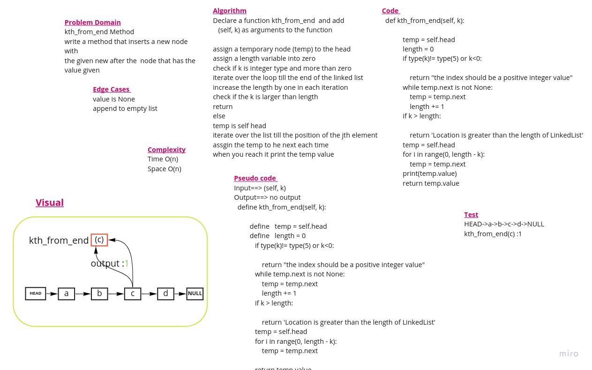

#  Linked Lists
## Part Three of the Challenge  
## Challenge Type: Kth element

***kth from end*** to find k-th value from the end of a linked list.

This function takes the argument  k. 
It Return the node’s value that is k places from the tail of the linked list.

  ## Approach & Efficiency
 * Time C omplexity O(n)
 * Space ComplexityO(1)AC
 

 ## Whiteboard Process 

## Solution
[Code](linked_list/linked_list_kth.py)

(<a href="#top">back to top</a>)

    

Ghaida Al Momani, Software Engineer

Jordan, Amman

22, 12 MAR 

