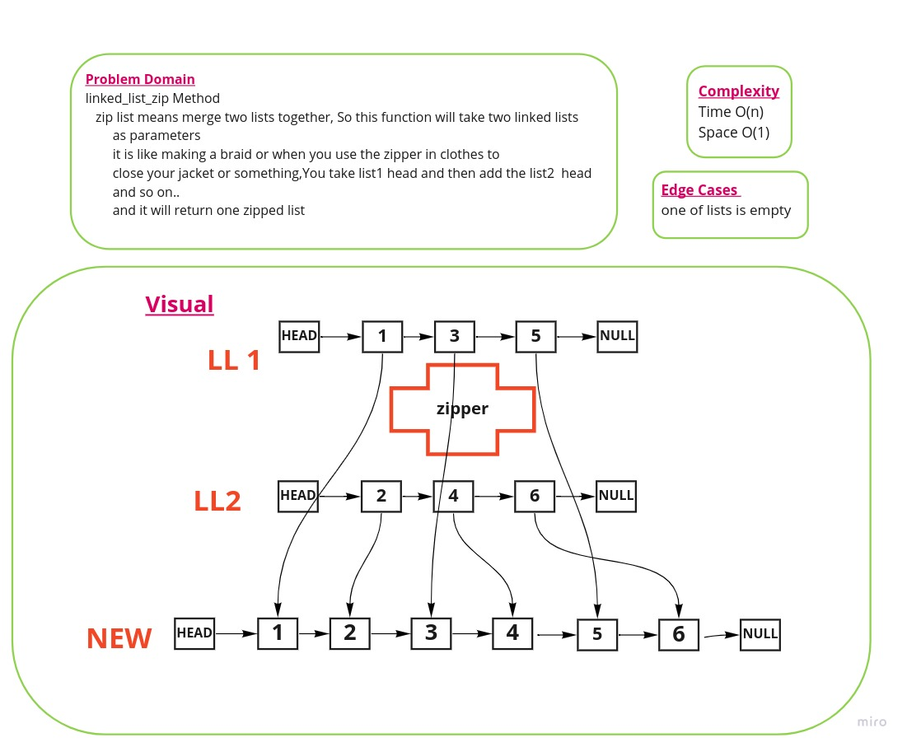
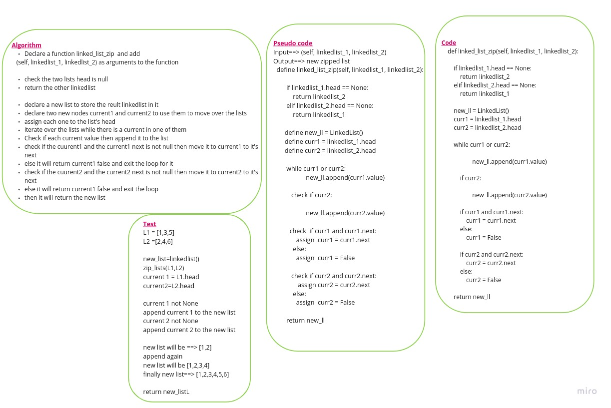

#  Linked Lists
## Part Four of the Challenge  
## Challenge Type: zipped lists

***kth from end*** to find k-th value from the end of a linked list.

# Code Challenge: Class 08

In this challenge we will Write a function called zip lists that takes two  linked lists
And it will Return: New Linked List, zipped as noted below
Zip the two linked lists together into one so that the nodes alternate between the two lists and return a reference to the the zipped list. paying attention to keep space down to O(1)
You have access to the Node class and all the properties on the Linked List class as well as the methods created in previous challenges.

 ## Whiteboard Process 

 
  ## Approach & Efficiency
 * Time Complexity O(n)
 * Space Complexity O(1)

## Solution
[Code](linked_list/linked_list_zipped.py)

(<a href="#top">back to top</a>)

  

Ghaida Al Momani, Software Engineer

Jordan, Amman

22, 12 MAR 

