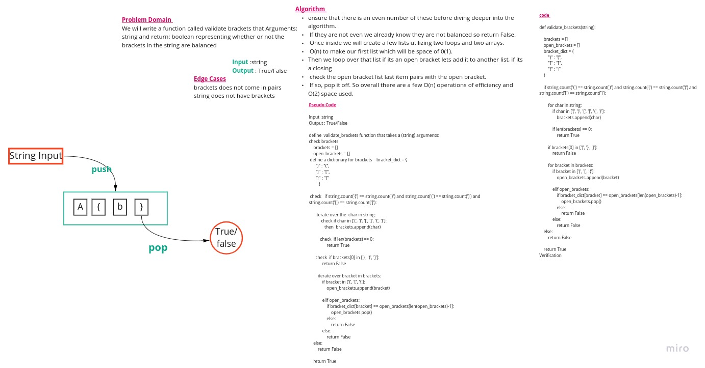

# Data Structures and Algorithms

## Code 401 - Advanced Software Development
<!-- This is the reading notes repository where I keep my favorite articles with their sources.
       
       Hope you'll benefit from my reads, Enjoy!
-->

By [Ghaida Al Momani] (https://github.com/GhaidaMomani).

>>>>>Welcome to Code 401.
 

 

# stack_queue_brackets

Multi-Bracket Validation is a challenge to verify that an inputed string has balanced brackets. It will return a boolean representing whether or not the brackets in the string are balanced. There are three types of brackets:

Round Brackets: ()
Square Brackets: []
Curly Brackets: {}

## [PR](https://github.com/GhaidaMomani/data-structures-and-algorithms/pull/11)

## Approach & Efficiency

**validate_brackets function**
This functions validates the brackets to check if there is an even number of them first 
The first loop has the complexity of O(n) for time and O(1) for space 
The next loop does the same work but for the closing brackets which make the function of O(n) time efficiency. 

## Whiteboard 

# API
[Code](../stack-queue-brackets/stack_queue_brackets/stack_queue_brackets.py)

   

Ghaida Al Momani, Software Engineer

Jordan, Amman

22, 4 APR 
