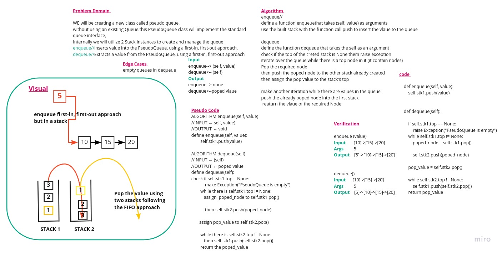

# Data Structures and Algorithms

## Code 401 - Advanced Software Development
<!-- This is the reading notes repository where I keep my favorite articles with their sources.
       
       Hope you'll benefit from my reads, Enjoy!
-->

By [Ghaida Al Momani] (https://github.com/GhaidaMomani).

>>>>>Welcome to Code 401.
 

 

# Pseudo Stacks and Queues

This is the implementation of the CC of Stacks and Queues on Branch Name: stack-and-queue/
They are aspecial and a well known data structure/

## [PR]()

## Approach & Efficiency

**Stack:**

* pop(value) - space and time O(1)
* push() - space and time O(1)
* peek() - space and time O(1)
* is_empty() space and time O(1)

**Queue:**

* enqueue: basiscally the push method which has the complexity of O(1) for both time and space 
* dequeue: this method has the complexity of O(n) for time since it uses two iterations 
* peek - space and time O(1)
* is_empty() - space and time O(1)

## Whiteboard 

# API
[Code](../stack-queue-pseudo/stack_queue_pseudo/stack_queue_pseudo.py)

## Node
Create a Node class that has properties for the value stored in the Node, and a pointer to the next node.
## Stack

Create a Stack class that has a top property. It creates an empty Stack when instantiated.
This object should be aware of a default empty value assigned to top when the stack is created.
The class should contain the following methods:

**push**

adds a new node with that value to the top of the stack with an O(1) Time performance.

**pop**

Returns: the value from node from the top of the stack
Removes the node from the top of the stack
Should raise exception when called on empty stack

**peek**

Returns: Value of the node located at the top of the stack
Should raise exception when called on empty stack

**is empty**

Returns: Boolean indicating whether or not the stack is empty.
## Queue

Queue class  has a front property. It creates an empty Queue when instantiated.
This object should be aware of a default empty value assigned to front when the queue is created.
The class should contain the following methods:

**enqueue**

adds a new node with that value to the back of the queue 

**dequeue**

Returns: the value from node from the front of the queue
in the first stack puts it's in the second stack 
Removes the node from the front of the queue
Should raise exception when called on empty queue

**peek**

Returns: Value of the node located at the front of the queue
Should raise exception when called on empty stack

**is empty**

Returns: Boolean indicating whether or not the queue is empty

   

Ghaida Al Momani, Software Engineer

Jordan, Amman

22, 28 MAR 
