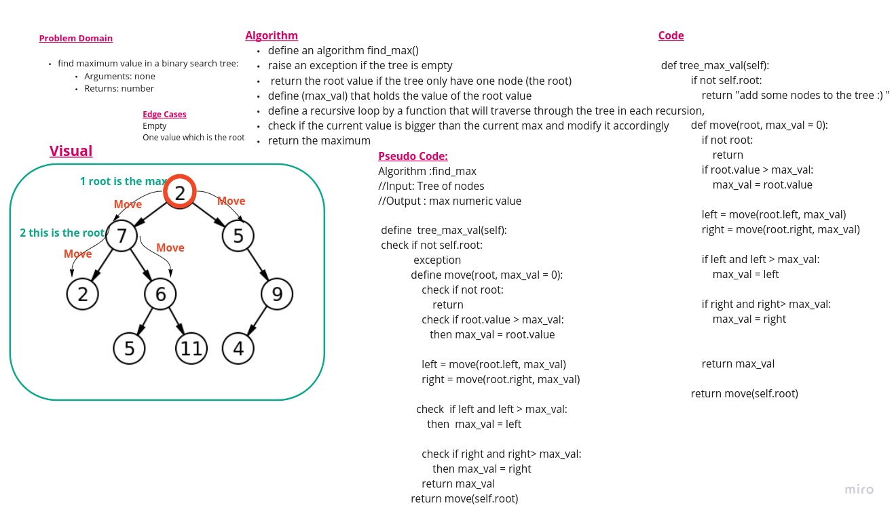

# Data Structures and Algorithms

## Code 401 - Advanced Software Development
<!-- This is the reading notes repository where I keep my favorite articles with their sources.
       
       Hope you'll benefit from my reads, Enjoy!
-->


By [Ghaida Al Momani] (https://github.com/GhaidaMomani).

>>>>>Welcome to Code 401.
<br/>
<hr/>
<br/>


# [PR](https://github.com/GhaidaMomani/data-structures-and-algorithms/pull/13)


 # Binary Tree and BST Implementation.


## Approach & Efficiency
* for method .pre_order time big O(n), space big O(n) because we are adding all values of the elements in the tree to the array
* for method .in_order time big O(n), space big O(n) because we are adding all values of the elements in the tree to the array
* for method .post_order time big O(n), space big O(n) because we are adding all values of the elements in the tree to the array
* for method .add() time big O(h) -height of the tree, space O(1)
* for contains .add() time big O(h) -height of the tree, space O(1)
* for breadth_first() method Time and space Big O(n)

## API
* _Node - Private class to create a nodes for the tree and also nodes for the Queue
* Queue - class to create a queue

* BinaryTree - Class to create a binary tree
* ----.pre_order() - BinaryTree method to return an array of trre values in "pre-order" order
* ----.in_order() - BinaryTree method to return an array of tree values "in-order"
* ----.post_order() - BinaryTree method to return an array of tree values "post-order
* ----.breadth_first - a BinaryTree static method which takes a Binary Tree as its unique input, traversing the input tree using a Breadth-first approach, and returns a list of the values in the tree in the order they were encountered.

* BinarySearchTree - Class to create a Binary Search Tree, inherits its properties from BinaryTree class
* ----.add(value) - BinarySearchTree method that accepts a value, and adds a new node with that value in the correct location in the binary search tree
* ----.contains(value) - BinarySearchTree method that accepts a value, and returns a boolean indicating whether or not the value is in the tree at least once.


# Features and tasks 

- [x] Can successfully instantiate an empty tree
- [x] Can successfully instantiate a tree with a single root node
- [x] For a Binary Search Tree, can successfully add a - [x] left child and right child properly to a node
- [x] Can successfully return a collection from a preorder traversal
- [x] Can successfully return a collection from an inorder traversal
- [x] Can successfully return a collection from a postorder traversal


--------
# Code Challenge :Find the Maximum Value in a Binary Tree
--------


## Find Maximum Value

---

### Problem Domain
Write an method called FindMaximumValue. 
Without utilizing any of the built-in methods available to your language, 
return the maximum value stored in the tree. You can assume that the values 
stored in the Binary Tree will be numeric.

---

### Inputs and Expected Outputs

| Internal State | Expected Output |
| :----------- | :----------- | 
| [10,20,40,50,30] |  [50]


---

### Big O

| Time | Space |
| :----------- | :----------- |
| O(n) | O(n) |

---


### Whiteboard Visual



# Approach & Efficiency

Big-O is o(n) for time because the recursive internal function, and o(1) for space because we only created one variable to hold the max value


# Solution

define an algorithm find_max() raise an exception if the tree is empty return the root value if the tree only have one node (the root) define (maximum) that holds the value of the root value define a recursive loop by a function that will traverse through the tree in each recursion, check if the current value is bigger than the current max and modify it accordingly return the maximum


``` python
    bt = BinarySearchTree()
    [bt.add(i) for i in [30,100,4,5,775,889,4,3]]

    print (bt.tree_max_val())

```

Output:
```
889
```


<hr/>
<br/><br/>

<p align="right">Ghaida Al Momani, Software Engineer</p>
<p align="right">Jordan, Amman</p>
<p align="right">22, 10 April> </p>


