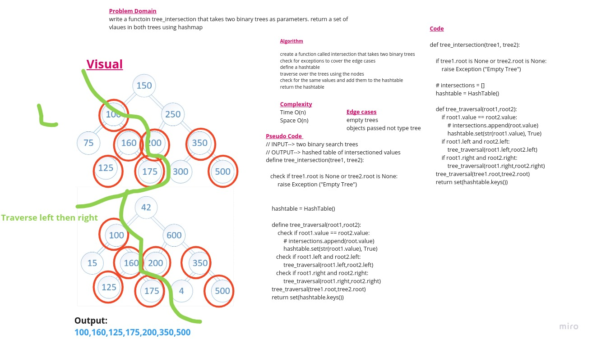

# [PR](https://github.com/GhaidaMomani/data-structures-and-algorithms/pull/22)
# Challenge Summary


## Whiteboard Process




## Approach & Efficiency
Complexity
Time O(n)
Space O(n)


## Solution
``` py
def tree_intersection(tree1, tree2):
    """
   Takes two binary tree roots and will return a list of intersecting values, 
   or nodes that share the same value at the same position in the tree.
    """
    if tree1.root is None or tree2.root is None:
        raise Exception ("Empty Tree")

   
    hashtable = HashTable()

    def tree_traversal(root1,root2):
        if root1.value == root2.value:
            # intersections.append(root.value)
            hashtable.set(str(root1.value), True)
        if root1.left and root2.left:
            tree_traversal(root1.left,root2.left)
        if root1.right and root2.right:
            tree_traversal(root1.right,root2.right)
    tree_traversal(tree1.root,tree2.root)
    return set(hashtable.keys())


```


<hr/>
<p align="right">(<a href="#top">back to top</a>)</p>
<br/><br/>
<p align="right">Ghaida Al Momani, Software Engineer</p>
<p align="right">Jordan, Amman</p>
<p align="right">22, 25 May </p>
